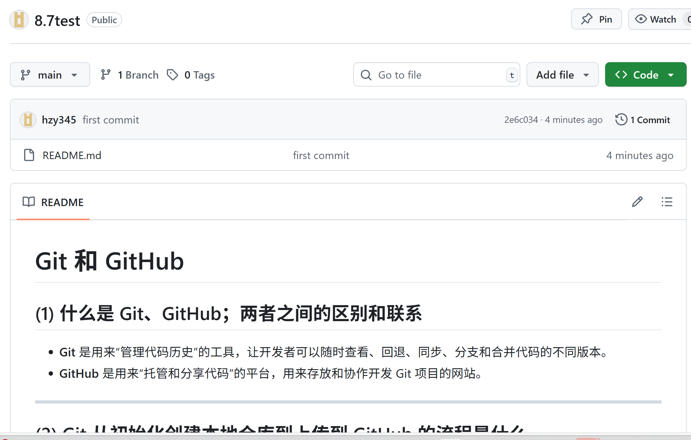

# Git 和 GitHub

## (1) 什么是 Git、GitHub；两者之间的区别和联系

- **Git** 是用来“管理代码历史”的工具，让开发者可以随时查看、回退、同步、分支和合并代码的不同版本。
- **GitHub** 是用来“托管和分享代码”的平台，用来存放和协作开发 Git 项目的网站。

---

## (2) Git 从初始化创建本地仓库到上传到 GitHub 的流程是什么

###  Git 初次绑定：

```bash
git config --global user.name "你的用户名"
git config --global user.email "你的邮箱"
```

###  创建新仓库：

```bash
git init                        # 初始化本地仓库（会生成 .git 隐藏目录）
git add .                       # 添加所有文件到暂存区
git commit -m "说明"            # 提交到本地仓库，写一条提交说明
git remote add origin https://github.com/你的用户名/my-project.git
git push -u origin master       # 或 main，取决于默认分支名
```

---

## (3) 本地仓库如何创建新的分支

```bash
git branch                 # 查看有哪些分支
git branch 分支名           # 创建新分支
git checkout 分支名         # 切换到该分支
git checkout -b 分支名      # 创建并切换分支
git branch -d 分支名        # 删除本地分支
```

---

## (4) 如何修改本地仓库的远程连接

```bash
git remote -v                                 # 查看当前远程地址
git remote set-url origin 新的仓库地址         # 修改远程仓库地址
```

---

## (5) 如果我在创建仓库的时候选择了添加 README，后续会出现什么问题？该如何解决？

**问题：** 本地仓库推送时会报错，因为远程仓库的初始提交（README）与你本地的不一致。
  
###  解决方法：

**方法一：** GitHub 上先删除 README 文件

**方法二：** 本地先拉取远程更新，再推送

```bash
git pull origin main --allow-unrelated-histories
git push -u origin main
```

---

### 示例：C 语言代码块（加法演示）

```c
#include <stdio.h>

int main() {
    int a = 2;
    int b = 3;
    int sum = a + b;

    printf("结果是：%d\n", sum);
    return 0;
}
```

---

### 📘 近五天学习成果汇总

| 日期       | 学习内容简介                                             | 收获总结                         |
|------------|----------------------------------------------------------|----------------------------------|
| 8.3     | 学习 SolidWorks，手工抄画轮毂，查看装配图                           | 熟悉建模界面，了解零件绘制流程 |
| 8.4     | 学习 PCB 绘制与布线                                      | 掌握了基本布线原则和器件摆放   |
| 8.5     | 学习 YOLO，实现模型训练与测试                           | 能训练自己的模型并做推理测试   |
| 8.6     | 学习电机的整备，了解电机相关知识                         | 掌握了电机种类、控制方式等基础 |
| 8.7     | 学习 Markdown 语法、Git 和 GitHub，安装 Keil5 开发工具 | 文档写作与代码协作能力提升     |

---

### 💻 软件安装情况汇总

| 软件名称                       | 安装状态 | 备注说明                     |
|-------------------------------|----------|------------------------------|
| SolidWorks                    |  已安装 | 用于建模、画轮毂             |
| 嘉立创 EDA  软件套件  |  已安装 | 用于 PCB 设计与打样         |
| 电机整备上位机软件            |  已安装 | 支持电机整定与参数配置     |
| Keil5                         |  已安装 | 用于嵌入式开发               |
| YOLO 环境（Python + Ultralytics） |  已配置 | 可进行模型训练与推理         |
| Git + GitHub                  |  已配置 | 完成 Git 账号配置与连接     |
| Markdown 编辑环境 |  已配置 | 支持语法高亮与预览           |

---
### github上传


